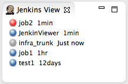

# Jenkins Viewerプラグイン

ＣＩ（継続的インテグレーション）ツールである [Jenkins CI](http://jenkins-ci.org/) のジョブの状態を
監視するためのEclipseプラグインです。

**特徴**
* 邪魔にならない。必要な情報のみをコンパクトにビューにまとめました。
* ジョブをフィルターできる。監視したいジョブのみを表示できるようにフィルター機能を用意しました。
* ダブルクリックにより、すばやくブラウザを起動しJenkinsにアクセスできます。

## ダウンロード

最新バージョン　[JenkinsViewer_0.3.0.201302231859.jar](http://tin.li/mdd)

## 使い方

### インストール
上記よりプラグインのjarファイルをダウンロードし、eclipseのインストールフォルダのdropinsフォルダにコピーするだけです。

ただし、Eclipseの再起動が必要です。

### 設定
1. メニューより ウィンドウ > 設定 を開き、Jenkins Viewerを選択します。
2. 監視対象のJenkins URL（例：http://localhost:8080/jenkins）を設定します。
3. メニューより ウィンドウ > ビューの表示 > その他 を選択します。
4. Jenkins > Jenkins Viewを選択します。 
5. Jenkins Viewerが表示されます。

### フィルター
フィルター機能を使えば様々なジョブを表示できます。

#### ジョブ名でフィルターする

name=[job名]

job名に正規表現の利用可能。

* 例）intraから始まるジョブだけを表示したい場合　`name=intra.*1` 
* 例）job1, job2だけを表示したい場合 `name=job1|job2`
* 例）testを除いて表示したい場合 `name=(?!test).*`

#### ビルド結果でフィルターする

result=[ビルド結果]

* 例）失敗したビルドだけを表示したい場合 `result=FAILURE`
* 例）成功したビルドだけを表示したい場合 `result=SUCCESS`

### アイコンの色でフィルターする

color=[アイコンの色]

* 例）赤いアイコンのビルドだけを表示したい場合 `color=red.*`
ー 実行中は`red_anime`のようになるため、正規表現にしています。

